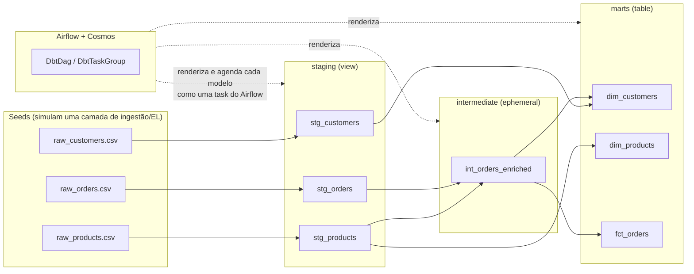

# Airflow + dbt + Cosmos — Pipeline de E-commerce (Projeto de Estudo)

## Visão geral

Este projeto é um pipeline de dados de estudo, construído com padrão de qualidade
próximo ao que se esperaria em um ambiente real de produção. Ele simula o fluxo de
uma empresa de e-commerce: dados brutos de clientes, produtos e pedidos são
transformados em camadas (staging → intermediate → marts) usando **dbt**, e todo
esse processo é orquestrado, agendado e monitorado pelo **Apache Airflow** através
do **Astronomer Cosmos**.

O objetivo não é só "rodar um pipeline", mas servir como referência de arquitetura:
cada escolha técnica (Astro CLI, Cosmos, DuckDB, camadas do dbt, virtualenv isolado
para o dbt) é feita — e documentada — pensando em como isso seria feito em um time
de dados de verdade, e não apenas da forma mais simples possível.

## Stack utilizada

| Tecnologia | Papel no projeto |
|---|---|
| **Apache Airflow** | Orquestrador: agenda, executa e monitora o pipeline como uma DAG de tasks. |
| **Astro CLI (Astronomer)** | Empacota o Airflow em containers Docker prontos para desenvolvimento local, sem precisar montar um `docker-compose` do zero. |
| **dbt (dbt Core)** | Motor de transformação: converte SQL em modelos versionados, testáveis e documentados (staging → intermediate → marts). |
| **Astronomer Cosmos** | Ponte entre Airflow e dbt: transforma cada modelo dbt em uma task/task group nativa do Airflow, em vez de chamar `dbt run` como um comando de shell opaco. |
| **DuckDB** | Banco de dados analítico embutido (in-process) usado como o "warehouse" local do dbt — sem servidor, sem credenciais, ideal para desenvolvimento e estudo. |

## Arquitetura



Fluxo textual equivalente:

```
seeds (raw_customers, raw_products, raw_orders)
        │
        ▼
   staging (stg_*)        <- views: renomeia, converte tipos, limpa
        │
        ▼
 intermediate (int_*)     <- ephemeral: junta pedidos + produtos, calcula net_amount
        │
        ▼
    marts (dim_*, fct_*)  <- tables: prontas para BI/analistas

Todo esse grafo de dependências é lido pelo Cosmos a partir do manifest do dbt e
recriado como um grafo de tasks do Airflow (uma DAG dentro da DAG).
```

## Explicação das partes

### Airflow

- **`dags/`**: pasta padrão onde o Airflow procura arquivos Python que definem DAGs
  (Directed Acyclic Graphs). Cada arquivo aqui é "parseado" periodicamente pelo
  scheduler do Airflow.
- **DAG (`dbt_dag.py`)**: define quando e como o pipeline dbt roda. Em vez de uma
  DAG manual com `BashOperator`, usamos o Cosmos para gerar automaticamente uma
  task (ou task group) para cada modelo dbt, incluindo as tasks de teste,
  preservando a ordem de dependência definida no próprio dbt (`ref()`/`source()`).
- **Tasks**: cada nó da DAG. Com Cosmos, cada modelo dbt vira normalmente duas
  tasks encadeadas — `run` (materializa o modelo) e `test` (roda os testes daquele
  modelo) — de forma que um teste que falha impede os modelos downstream de
  rodarem sobre dados ruins.

### dbt

- **`seeds/`**: arquivos CSV versionados que o dbt carrega como tabelas no banco.
  Aqui eles fazem o papel de "dados brutos que uma ferramenta de ingestão (EL)
  já teria carregado", já que este é um projeto de estudo sem uma fonte externa
  real.
- **`models/staging/`**: a camada mais próxima do dado bruto. Um modelo de
  staging faz apenas renomeação de colunas, cast de tipos e limpezas simples
  (trim, lower). Nunca tem `JOIN` nem lógica de negócio. Materializado como
  **view** — barato e sempre atualizado.
- **`models/intermediate/`**: modelos de "encanamento" (plumbing) que existem só
  para servir outros modelos — por exemplo, juntar pedidos com o preço do
  produto e calcular o valor líquido da linha uma única vez. Materializados como
  **ephemeral**, ou seja, o dbt os transforma em uma CTE dentro do SQL compilado,
  sem criar nada físico no banco.
- **`models/marts/`**: a camada final, pronta para consumo por ferramentas de BI
  ou analistas — tabelas de dimensão (`dim_customers`, `dim_products`) e de fato
  (`fct_orders`). Materializados como **table**, priorizando velocidade de
  leitura em vez de custo de armazenamento.
- **`tests/`**: testes **genéricos** (`not_null`, `unique`, `relationships`,
  `accepted_values`) ficam declarados dentro dos arquivos `_*.yml` ao lado de
  cada modelo e cobrem regras estruturais comuns (chave única, chave estrangeira
  válida, etc). Já os testes **singulares** (customizados), como
  `assert_positive_order_amounts.sql`, são arquivos `.sql` que expressam uma
  regra de negócio que um teste genérico não conseguiria descrever (neste caso:
  pedidos completos nunca podem ter valor líquido zero ou negativo).

## Decisões de arquitetura e o porquê

### Por que Astro CLI em vez de docker-compose puro

O Astro CLI já entrega uma imagem do Airflow testada, com Webserver, Scheduler,
Triggerer e Postgres de metadados prontos e integrados, além de comandos como
`astro dev start`/`astro dev restart` que automatizam o ciclo de
build-e-reload durante o desenvolvimento. A alternativa ingênua — montar um
`docker-compose.yml` do zero — exige reproduzir manualmente toda essa
orquestração de serviços, mantê-la atualizada a cada nova versão do Airflow, e
lidar com detalhes de rede/volumes que o Astro CLI já resolve. Isso é
retrabalho que não agrega nada ao aprendizado sobre Airflow ou dbt em si.

### Por que Cosmos em vez de `BashOperator` chamando `dbt run` direto

Um `BashOperator` rodando `dbt run` trata o projeto dbt inteiro como uma caixa
preta: o Airflow só sabe que "uma task chamada dbt rodou", sem visibilidade de
quais modelos rodaram, qual falhou, ou como eles dependem uns dos outros. Com
Cosmos, cada modelo (e cada teste) vira uma task individual do Airflow,
respeitando o grafo de dependências (`ref()`) do dbt — isso dá lineage visual
na UI do Airflow, retries por modelo individual em vez de todo o projeto, e a
possibilidade de um teste falho travar só o que depende dele, não o pipeline
inteiro.

### Por que a divisão em camadas staging/intermediate/marts

Sem essa separação, seria comum um único modelo "gigante" misturar limpeza de
dado bruto, joins de negócio e agregação final — difícil de testar, de
depurar e de reaproveitar. Separando em camadas: staging garante que qualquer
modelo mais acima sempre parte de um dado já limpo e com nomes consistentes;
intermediate isola lógica de junção/cálculo que seria duplicada em vários
marts; marts concentra só o resultado final, pronto para consumo. Isso também
permite aplicar a estratégia de materialização certa para cada papel (visto
acima), em vez de tratar todo o projeto da mesma forma.

### Por que o banco de dados escolhido (DuckDB) foi adequado para este caso

Para um projeto de estudo local, sem múltiplos usuários concorrentes e sem
necessidade de um servidor de banco separado, o DuckDB roda embutido (in-process),
não pede nenhuma credencial e grava tudo em um único arquivo `.duckdb` — o que
elimina completamente a necessidade de subir um serviço extra (como o Postgres)
só para ter algo para o dbt escrever. A alternativa de usar Postgres simularia
melhor um ambiente "prod-like" (múltiplos usuários, permissões, rede), mas
adicionaria complexidade operacional (mais um container, uma Connection do
Airflow, credenciais) que não muda em nada o aprendizado sobre Airflow + dbt em
si — por isso ficou documentada como próximo passo, não como escolha inicial.

### Como os testes do dbt se encaixam no pipeline

Os testes **genéricos** (`not_null`, `unique`, `relationships`,
`accepted_values`), declarados nos arquivos `_*.yml`, validam garantias
estruturais básicas: uma chave nunca é nula, é única, aponta para uma linha
que realmente existe na tabela referenciada, ou está dentro de um conjunto de
valores esperado. O teste **singular** (`assert_positive_order_amounts.sql`)
expressa uma regra de negócio específica — um pedido `completed` nunca pode ter
`net_amount` zero ou negativo — algo que só uma query SQL de verdade consegue
verificar. Como o Cosmos roda a task de teste logo depois da task de `run` de
cada modelo, um teste que falha bloqueia o avanço da DAG para os modelos que
dependem daquele dado, funcionando como um "portão de qualidade" (quality gate)
antes de o dado chegar às camadas seguintes.

## Estrutura de pastas

| Caminho | Propósito |
|---|---|
| `dags/` | DAGs do Airflow (definição da orquestração). |
| `include/dbt/ecommerce/` | Projeto dbt completo (models, seeds, tests, configs). |
| `include/dbt/ecommerce/models/staging/` | Camada de limpeza 1:1 sobre os dados brutos. |
| `include/dbt/ecommerce/models/intermediate/` | Camada de joins/cálculos intermediários (ephemeral). |
| `include/dbt/ecommerce/models/marts/` | Camada final, consumida por BI/analistas. |
| `include/dbt/ecommerce/seeds/` | CSVs que simulam os dados brutos ingeridos. |
| `include/dbt/ecommerce/tests/` | Testes singulares (customizados) do dbt. |
| `plugins/` | Plugins customizados do Airflow (vazio neste projeto). |
| `Dockerfile` | Define a imagem do Airflow, incluindo o venv isolado do dbt. |
| `requirements.txt` | Dependências Python do lado do Airflow (inclui `astronomer-cosmos`). |
| `packages.txt` | Pacotes de sistema (apt) para a imagem — vazio, pois DuckDB não precisa. |
| `.env.example` | Modelo de variáveis de ambiente (copiar para `.env`, que é git-ignorado). |

## Como rodar o projeto localmente

1. **Instalar o Astro CLI** (se ainda não tiver): siga as instruções em
   https://www.astronomer.io/docs/astro/cli/install-cli.
2. **Configurar variáveis de ambiente**:
   ```bash
   cp .env.example .env
   ```
3. **Subir o ambiente local**:
   ```bash
   astro dev start
   ```
   Isso builda a imagem Docker (instalando o venv isolado do dbt, conforme o
   `Dockerfile`) e sobe Webserver, Scheduler, Triggerer e o Postgres de
   metadados do Airflow.
4. **Acessar a UI do Airflow**: abra `http://localhost:8080` (usuário/senha
   padrão do Astro: `admin` / `admin`) e ative a DAG do pipeline dbt.
5. **Rodar o dbt manualmente para depuração** (fora do Airflow, útil para
   iterar mais rápido em um modelo específico):
   ```bash
   astro dev bash
   cd include/dbt/ecommerce
   /usr/local/airflow/dbt_venv/bin/dbt build
   ```
   `dbt build` roda seeds + models + testes em sequência e já para no primeiro
   erro/teste falho.
6. **Gerar e visualizar a documentação do dbt**:
   ```bash
   /usr/local/airflow/dbt_venv/bin/dbt docs generate
   /usr/local/airflow/dbt_venv/bin/dbt docs serve
   ```

## Próximos passos

- Substituir os seeds por uma fonte de dados real ou gerada dinamicamente
  (ex: uma API, ou um gerador de dados sintéticos maior).
- Adicionar CI/CD: rodar `dbt build` automaticamente em cada Pull Request antes
  do merge, usando um ambiente `target` isolado (ex: schema temporário).
- Migrar os modelos de `marts` para `incremental`, para que cada execução
  processe só linhas novas/alteradas em vez de reconstruir a tabela inteira.
- Avaliar a migração para **dbt Fusion** quando/se o projeto migrar para um
  warehouse com suporte a ele (Snowflake, Databricks, BigQuery ou o preview do
  Redshift) — hoje o Cosmos só orquestra Fusion sob `ExecutionMode.LOCAL` e
  não existe adapter de DuckDB para o Fusion.
- Trocar o DuckDB por Postgres (ou outro warehouse) para simular um ambiente
  mais próximo de produção, com Connections do Airflow guardando credenciais
  reais em vez de um único caminho de arquivo.